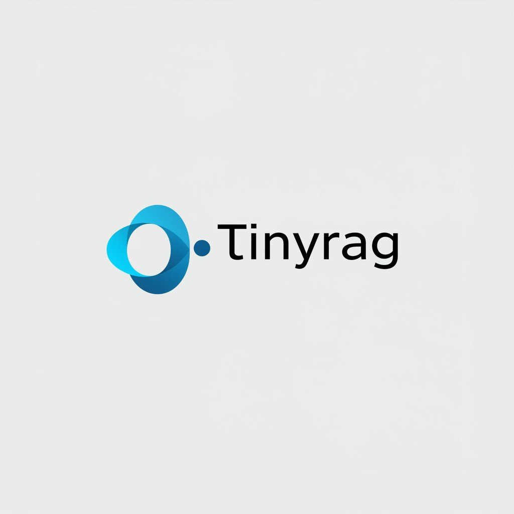

# TinyRag 🚀

[](https://badge.fury.io/py/tinyrag)
[](https://www.python.org/downloads/)
[](https://opensource.org/licenses/MIT)

A minimal, powerful Python library for **Retrieval-Augmented Generation (RAG)** with **codebase indexing** and support for multiple document formats and vector storage backends.

## 🌟 Features

- **🔌 Multiple Vector Stores**: Faiss, ChromaDB, In-Memory, Pickle-based
- **📄 Document Support**: PDF, DOCX, TXT, and raw text
- **💻 Codebase Indexing**: Function-level indexing for all major programming languages
- **🧠 Default Embeddings**: Uses all-MiniLM-L6-v2 by default (no API key needed)
- **🚀 Multithreading Support**: Parallel document processing for faster indexing
- **🔍 Query Without LLM**: Direct similarity search functionality
- **💬 Optional LLM Integration**: Chat completion with retrieved context
- **⚡ Minimal Setup**: Works out of the box without configuration
- **🎯 Easy to Use**: Simple API with powerful features

## 🚀 Quick Start

### Installation

```bash
# Basic installation
pip install tinyrag

# With all optional dependencies
pip install tinyrag[all]

# Specific vector stores
pip install tinyrag[faiss]    # High performance
pip install tinyrag[chroma]   # Persistent storage
pip install tinyrag[docs]     # Document processing
```

### Usage Examples

#### Basic Usage (No API Key Required)
```python
from tinyrag import TinyRag

# Initialize with default all-MiniLM-L6-v2 embeddings
rag = TinyRag()

# Add documents and codebase
rag.add_documents(["doc1.pdf", "doc2.txt", "Raw text"])
rag.add_codebase("./my_project")  # Index entire codebase

# Query documents and code
results = rag.query("What is this about?")
code_funcs = rag.search_code("authentication function")
print("Similar chunks:", results)
print("Code functions:", code_funcs)
```

#### With LLM for Chat
```python
from tinyrag import Provider, TinyRag

provider = Provider(
    api_key="sk-xxxxxx",
    model="gpt-4",
    embedding_model="default",
    base_url="https://api.openai.com/v1"
)

rag = TinyRag(provider=provider, vector_store="faiss", max_workers=4)

rag.add_documents([
    "path/to/docs_or_raw_text",
    "Another document", 
    "More content"
])

response = rag.chat("Summarize the documents.")
print(response)
```

## 📖 Documentation

### Core Components

#### Provider Class
Handles API interactions and embeddings:

```python
from tinyrag import Provider

# Local embeddings only (no API key needed)
provider = Provider(embedding_model="default")

# With OpenAI API
provider = Provider(
    api_key="sk-your-key",
    model="gpt-4",
    embedding_model="text-embedding-ada-002",
    base_url="https://api.openai.com/v1"
)
```

#### TinyRag Class
Main interface for RAG operations:

```python
from tinyrag import TinyRag

# Initialize with different vector stores
rag = TinyRag(provider, vector_store="memory")     # No dependencies
rag = TinyRag(provider, vector_store="faiss")      # High performance  
rag = TinyRag(provider, vector_store="chroma")     # Persistent
rag = TinyRag(provider, vector_store="pickle")     # Simple file-based
```

### Vector Store Comparison

| Store | Performance | Persistence | Memory | Dependencies | Best For |
|-------|-------------|-------------|---------|--------------|----------|
| **Memory** | Good | Manual | High | None | Development, small datasets |
| **Faiss** | Excellent | Manual | Low | faiss-cpu | Large-scale, performance-critical |
| **ChromaDB** | Good | Automatic | Medium | chromadb | Production, automatic persistence |
| **Pickle** | Fair | Manual | Medium | scikit-learn | Simple file-based storage |

### API Reference

#### Core Methods

```python
# Document Management
rag.add_documents(data)                    # Add documents/text
rag.get_chunk_count()                      # Get number of chunks
rag.get_all_chunks()                       # Get all text chunks
rag.clear_documents()                      # Clear all data

# Codebase Indexing
rag.add_codebase(path)                     # Index codebase at function level
rag.search_code(query, k=5, language=None) # Search code functions
rag.get_function_by_name(name, k=3)        # Find functions by name

# Querying (No LLM)
rag.query(query, k=5, return_scores=True) # Basic similarity search
rag.search_documents(query, k=5, min_score=0.0) # With score filtering
rag.get_similar_chunks(text, k=5)         # Find similar to given text

# LLM Integration
rag.chat(query, k=3)                      # Generate response with context

# Persistence
rag.save_vector_store(filepath)           # Save to disk
rag.load_vector_store(filepath)           # Load from disk
```

### Codebase Indexing

TinyRag can automatically parse and index codebases at the function level:

#### Supported Languages
- **Python** (.py)
- **JavaScript/TypeScript** (.js, .ts)
- **Java** (.java)
- **C/C++** (.c, .cpp, .cc, .cxx, .h)
- **Go** (.go)
- **Rust** (.rs)
- **PHP** (.php)

#### Usage Examples

```python
from tinyrag import TinyRag

rag = TinyRag()

# Index entire codebase
rag.add_codebase("./my_project", recursive=True)

# Search for specific functionality
auth_functions = rag.search_code("authentication login", k=5)

# Search by programming language
python_funcs = rag.search_code("database query", language="python")

# Find specific function
user_func = rag.get_function_by_name("create_user")

# Code-aware chat (with API key)
response = rag.chat("How does the authentication system work?")
```


## 🔧 Configuration Options

### Vector Store Configuration

```python
# Faiss with custom settings
rag = TinyRag(
    provider=provider,
    vector_store="faiss",
    chunk_size=1000,  # Larger chunks
    vector_store_config={}
)

# ChromaDB with persistence
rag = TinyRag(
    provider=provider,
    vector_store="chroma", 
    vector_store_config={
        "collection_name": "my_collection",
        "persist_directory": "./chroma_db"
    }
)

# Memory store (no config needed)
rag = TinyRag(provider=provider, vector_store="memory")

# Pickle store with scikit-learn
rag = TinyRag(provider=provider, vector_store="pickle")
```

### Provider Configuration

```python
# Local embeddings only
provider = Provider(embedding_model="default")

# OpenAI with custom settings
provider = Provider(
    api_key="sk-your-key",
    model="gpt-3.5-turbo",
    embedding_model="text-embedding-ada-002",
    base_url="https://api.openai.com/v1"
)

# Custom API endpoint
provider = Provider(
    api_key="your-key",
    model="custom-model",
    base_url="https://your-custom-api.com/v1"
)
```

## 📦 Installation Options

```bash
# Minimal installation
pip install tinyrag

# With specific vector stores
pip install tinyrag[faiss]      # For high-performance similarity search
pip install tinyrag[chroma]     # For persistent vector database
pip install tinyrag[pickle]     # For simple file-based storage

# With document processing
pip install tinyrag[docs]       # PDF and DOCX support

# Everything included
pip install tinyrag[all]        # All optional dependencies
```

## 🛠️ Development

### Requirements

- Python 3.7+
- sentence-transformers (core)
- requests (core)
- numpy (core)

### Optional Dependencies

- `faiss-cpu`: High-performance vector search
- `chromadb`: Persistent vector database
- `scikit-learn`: Pickle vector store similarity
- `PyPDF2`: PDF document processing
- `python-docx`: Word document processing

### Contributing

1. Fork the repository: https://github.com/Kenosis01/TinyRag.git
2. Create a feature branch: `git checkout -b feature-name`
3. Make your changes and add tests
4. Submit a pull request

## 📄 License

This project is licensed under the MIT License - see the [LICENSE](LICENSE) file for details.

## 🤝 Support

- **GitHub Issues**: [Report bugs or request features](https://github.com/Kenosis01/TinyRag/issues)
- **Documentation**: [Full documentation](https://github.com/Kenosis01/TinyRag)
- **Examples**: Check the `examples/` directory in the repository

## 🎯 Use Cases

- **Document Q&A**: Query your documents without LLM costs
- **Knowledge Base**: Build searchable knowledge repositories  
- **Content Discovery**: Find similar content in large document collections
- **RAG Applications**: Full retrieval-augmented generation workflows
- **Research Tools**: Semantic search through research papers
- **Customer Support**: Query company documentation and policies

---

**TinyRag** - Making RAG simple, powerful, and accessible! 🚀
